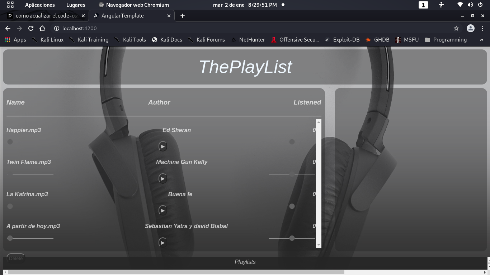
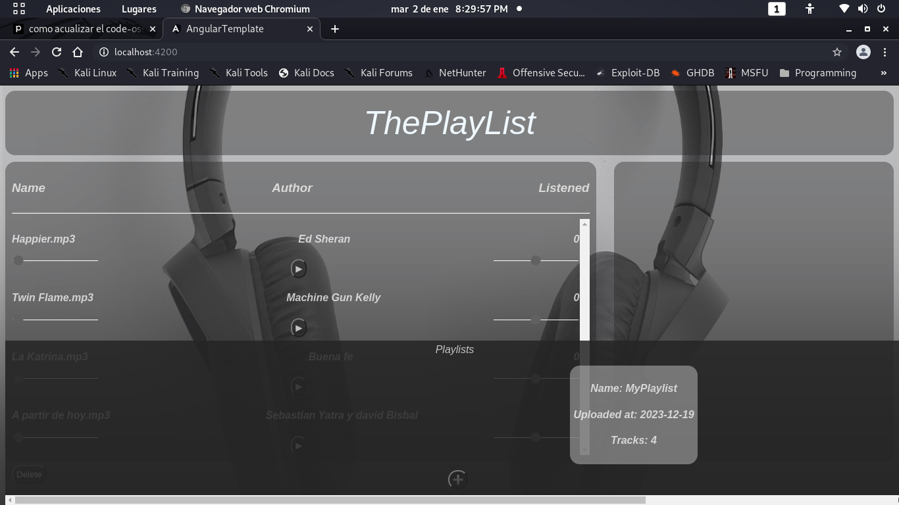
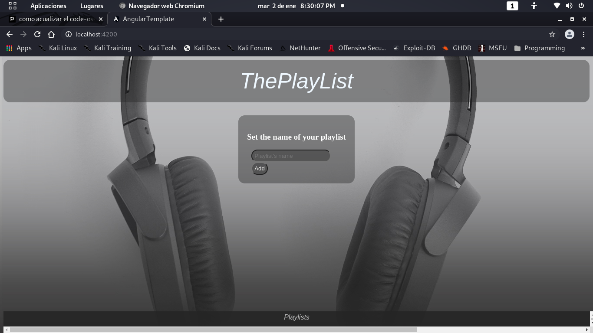

# ThePlaylis social network
This is a litle social network build using Nestjs framwork in the backend, and Angular for the frontend.
Here the people can listen and download music.
The songs are grouped on playlists. Those playlists are managed by the page owner for now. but the code can be easily changed to
that everybody can upload their musics and create theirs owns playlists and share with the community.

# Details
## Stage of the project
DEVELOPING

The backend-frontend communication was build using GraphQL for the querys and mutations manage, while the upload-download files are
managed through endpoints.
To upload a song the frontend first have to ask a link of upload to the backend, this link is temporal and will be
invalidated in 5 seconds after its emission

# Main view
The main view is still in design phase, this is a first idea of how it looks

To create a new playlist, set the mouse over the bar on the bottom of the page, them the view will look like this

Them click the button, fill the fields and that's all.

The download-upload functonality is ready, rests add the visuals elements to do this functions.